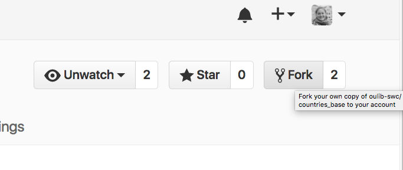
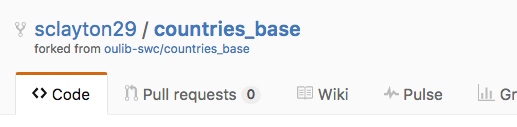

## Finding Repositories on GitHub

Now, we will see how GitHub can be used as a powerful collaboration tool. To begin, we need to navigate to the countries repository the instructor created during the set up for this lesson. In the search box on the top, search for the name of the repository.

GitHub allows users to search on different levels. If you are already in a repository, it will automatically search within that repo. As an indicator, "this repository" will appear in the search bar. Since we want to search all GitHub repositories, click the GitHub icon to reset the search settings.

Once we have located the repository, clicking the title will take us to the repo. There is one folder and a README.md file within the directory. We can explore the files within the GitHub interface. Click on countries and then any of the markdown(.md) files.

>## README.md
>Remember that it is best practice to always have a README.md file within your repository. It should be descriptive so others (or you in a few months) will understand the purpose/structure of your code.
{: .callout}

Each of these files contains spaces for information about the population, capital, offical language, and interesting trivia for a specific country. Our goal today is to update a few of the files with information about the designated country.

Unlike our earlier experience GitHub, we do not own this repository. We can quickly identify the owner by looking at the repostiory name located directly beneath the search bar. The first part of the name is the GitHub user who owns the repository followed by a slash and the repository's name. The owner could be an individual or organizaiton.

## Forking a Project on GitHub

Since we do not own this project, we don't want to make changes directly to this code. Instead, we should make a copy of the code, make our changes, and submit it to the owner. If the owner likes our changes, she can then incorporate it into the original repo.

In GitHub, making a copy of a repository is called forking. In the top right corner of the page, under your profile picture, there are three buttons. Click on Fork to create a forked copy of the repo. The number beside Fork indicates the number of times the original repo has been forked.

After you fork the repo, GitHub will automatically redirect you to your forked verison. The forked repository is identical to the original repo. The forked verison includes all of the commits and contributors as the original.

>## Selecting where to fork
> If you are a member of organizations on GitHub, you will need to select where you want to fork the repository. For this exercise, please select your personal GitHub account.
{: .callout}

If we look at the title, we can see that the owner has changed. Now, our account name is listed before the name of the repository. There is also a link to the original repo.

## Cloning your fork

Now that we have our own fork, we are ready to start adding information.
When collaborating on projects in GitHub, it is a good idea to plan with the group
who will work on what.

Everyone should choose a country you want to work on, and add your name and the country to
the Etherpad. Try to get a country no one else is working on.

First, we'll clone our fork so that we can modify it.

~~~
$ cd ~/Desktop
$ git clone https://github.com/YOUR-ACCOUNT/countries.git
$ cd YOUR-FORK
~~~
{: .bash}

## Working Locally On a Branch

Let's check the status of our fork.

~~~
$ git status
~~~
{: .bash}

~~~
On branch master
Your branch is up-to-date with 'origin/master'.
nothing to commit, working directory clean
~~~
{: .output}
Notice it says we are "On branch master". Whenever you are working on a git
repo, you are working on a branch. Unless you or someone else changes it, by
default, you are working on a branch called "master". Using branches allows us
to do things like work on new additions/features for our project that we aren't
sure we want to keep yet, or maybe it is a change we want to propose as an addition
to someone else's project.

There is another command we can use to check what branch we are on.
~~~
$ git branch
~~~
{: .bash}

~~~
* master
~~~
{: .output}

You can also create new branches with this command and call them whatever you
like--though it may help you and your collaborators if it is a relevant name.
Let's create a branch called `update-country`.

~~~
$ git branch update-country
~~~
{: .bash}

This created a branch, but we are still on `master` branch. We use `git checkout`
to change to working on our new branch.

~~~
$ git checkout update-country
~~~
{: .bash}

~~~
Switched to branch 'update-country'
~~~
{: .output}

Now if you use `git branch` you see a list of your branches and which is active.
~~~
$ git branch
~~~
{: .bash}

~~~
  master
* update-country
~~~
{: .output}

In your locally cloned repository, edit the file in the `countries` folder, make your changes to the country that you wish to update.

~~~
$ cd countries
$ nano United_States.md
~~~
{: .bash}

Once you're happy with your changes, commit and push them to your forked repository as normal:

~~~
$ git add United_States.md
$ git commit -m "Updating facts about the US."
$ git push origin update-country
~~~
{: .bash}

## Sharing Your Work on GitHub

With your new changes pushed to GitHub, you can use the GitHub web interface to create a Pull
Request to share your changes with owners of the upstream repository. In your web browser, go
to your account's fork of the countries repo. If you already have it open, refresh the page.
When you do this you will see a yellow bar with a green `Compare and pull request` button.
Let's click the button.

Opening a pull request is how we let the original repo owners, who we want to collaborate
with, know that we have a contribution to the project that we would like
them to consider including. On the `Open a pull request page, you can see the changes you are
proposing. If they look like what you want, update the title and comment boxes to let everyone
know what you have opened the Pull Request for.

## Updating Your Fork

Back in our terminal, we are ready to do more work on the project while we await a
response regarding our pull request. Let's check our status.

~~~
$ git status
~~~
{: .bash}

~~~
On branch update-country
nothing to commit, working directory clean
~~~
{: .output}

Since we have completed what we wanted to finish on our country, we want to go back
to using our master branch.

~~~
$ git checkout master
~~~
{: .bash}

~~~
Switched to branch 'master'
Your branch is up-to-date with 'origin/master'.
~~~
{: .output}

~~~
$ git branch
~~~
{: .bash}

~~~
* master
  update-country
~~~
{: .output}

When collaborating on a project, it is important to keep your repo up-to-date with
the changes your collaborators are incorporating into the project.
In order to keep your fork updated and get any new changes made in the upstream repository,
you'll need to merge in upstream changes manually.

Begin by adding the upstream repository

~~~
$ git remote add upstream https://github.com/UPSTREAM/countries.git
$ git remote -v
$ git pull upstream master
$ git push origin master
$ git status
~~~
{: .bash}
